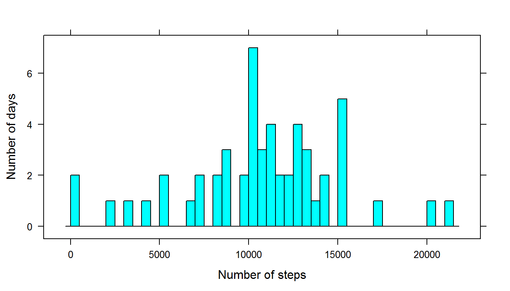
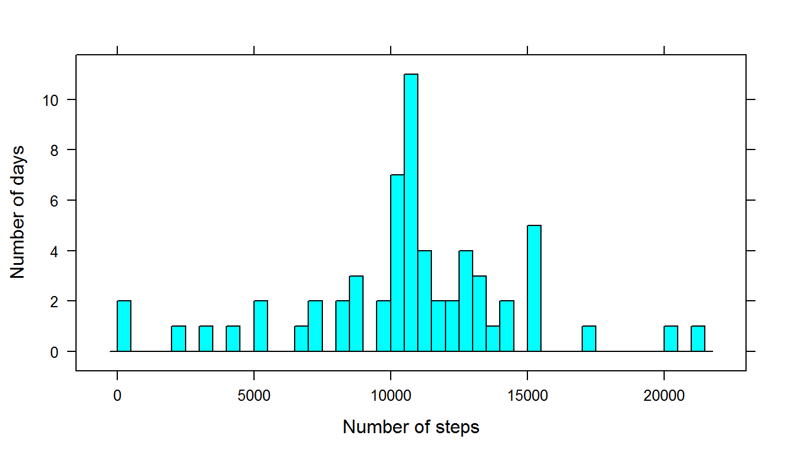

# PA1_template.Rmd
Anastasia Videneeva  
Sunday, January 18, 2015  


In this assignment data about personal movement will be studied.

1) **Loading data**


```r
library(lattice)
library(ggplot2)
data <- read.csv("activity.csv")
data$date <- as.Date(data$date, "%Y-%m-%d")
```

2) **Mean total steps taken per day**

In this part missing values are ignored. 
Making a histogram of the total number of steps taken per day 
and calculating mean and median total number of steps per day.


```r
data_no_na <- data[complete.cases(data),]
data_grouped_by_date <- aggregate(data_no_na$steps, 
                                  by = list(date = data_no_na$date), FUN = "sum")

histogram(data_grouped_by_date$x, xlab = "Number of steps", 
          ylab = "Number of days", type = "count", breaks = nrow(data_grouped_by_date))
```

 

```r
paste("Mean is", round(mean(data_grouped_by_date$x), digits = 3))
```

```
## [1] "Mean is 10766.189"
```

```r
paste("Median is", round(median(data_grouped_by_date$x), digits = 3))
```

```
## [1] "Median is 10765"
```

3) **Analyzing average daily activity pattern**                                  
                                  

```r
data_grouped_by_interval<- aggregate(data_no_na$steps, 
                                  by = list(interval = data_no_na$interval), FUN = "mean")

qplot(data_grouped_by_interval$interval, data_grouped_by_interval$x, geom = "line")+ xlab("interval") + ylab("average number of steps")
```

 

4) **Inputing missing values in dataset**

Total number of rows with missing values:

```r
nrow(data[complete.cases(data) == FALSE,])
```

```
## [1] 2304
```

Filling in missing values using mean for that 5-minute interval:

```r
data2 <- data
for(i in 1:nrow(data2)){
  if(complete.cases(data2)[i] == FALSE){
    data2$steps[i] <- subset(data_grouped_by_interval, interval == data2$interval[i])$x
  }
}
```

Histogram of the total number of steps taken each day:

```r
data_grouped_by_date2 <- aggregate(data2$steps, 
                                  by = list(date = data2$date), FUN = "sum")

histogram(data_grouped_by_date2$x, xlab = "Number of steps",
        ylab = "Number of days", type = "count", breaks = nrow(data_grouped_by_date2))  
```

 

Median and mean for the total number of steps taken per day:

```r
paste("Mean is", round(mean(data_grouped_by_date2$x), digits = 3))
```

```
## [1] "Mean is 10766.189"
```

```r
paste("Median is", round(median(data_grouped_by_date2$x), digits = 3))
```

```
## [1] "Median is 10766.189"
```

5) **Comparing activity patterns in weekends and weekdays**

```r
weekends <- c("Saturday", "Sunday")

for(i in 1:nrow(data2)){
  data2$weekday[i] <- (weekdays(data2$date[i]) != weekends[1] 
                      & weekdays(data2$date[i]) != weekends[2])
}

data_weekday <- data2[data2$weekday == TRUE,]
data_weekend <- data2[data2$weekday != TRUE,]

weekday_grouped_by_interval<- aggregate(data_weekday$steps, 
                                  by = list(interval = data_weekday$interval), 
                                  FUN = "mean")
weekday_grouped_by_interval$weekday <- TRUE

weekend_grouped_by_interval<- aggregate(data_weekend$steps, 
                                  by = list(interval = data_weekend$interval), 
                                  FUN = "mean")
weekend_grouped_by_interval$weekday <- FALSE

datares <- rbind(weekend_grouped_by_interval, weekday_grouped_by_interval)

f <- factor(datares$weekday, levels = c("TRUE", "FALSE"),labels = c("Weekdays", "Weekends"))
xyplot(datares$x ~ datares$interval | f, type = "l", layout = c(1, 2))
```

 
